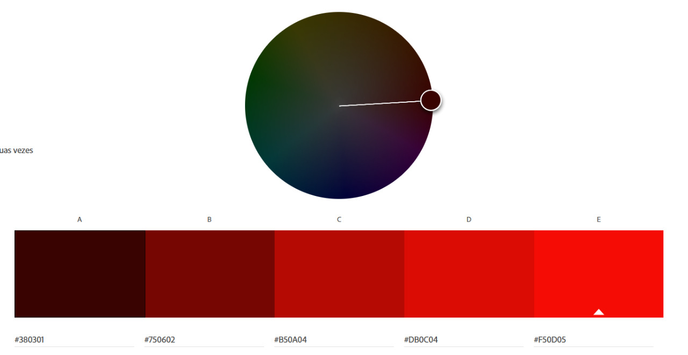

 

## :round_pushpin: Índice

* [1. Sobre o projeto](#1-sobre-o-projeto)
* [2. Histórias de usuários](#3-histórias-de-usuários)
* [3. Layout](#4-layout)
* [4. Experiência dos usuários](#5-experiência-dos-usuários)
* [5. Conteúdos abordados](#6-conteúdos-abordados)
* [6. Testes unitários](#7-testes-unitários)
* [7. Autoras](#8-autoras)

---

## 1. Sobre o projeto  :computer:

Phenomena é uma Rede Social que permite à qualquer usuário criar uma conta de acesso, logar-se com ela, criar, editar, deletar e dar likes em publicações.

 Esta rede social homenageia o filme de terror [PHENOMENA](https://www.imdb.com/title/tt0087909/), dirigido por Dario Argento. Criamos essa rede com intuito de unir a comunidade fã do genero terror, que há muito tempo não encontra um espaço para compartilhar sobre a temática. Se você se encaixa nesse perfil, está no lugar certo. 

O projeto foi realizado no  _bootcamp_ da [LABORATÓRIA](https://www.laboratoria.la/br).

## 2. Histórias de usuários :receipt:

Uma história do usuário é uma explicação informal e geral sobre um recurso de software escrita a partir da perspectiva do usuário final. Seu objetivo é articular como um recurso de software pode gerar valor para o cliente.

**Inserir print com as descrições das histórias de usuário**

## 3. Layout :art:

### Protótipo de baixa fidelidade :floppy_disk:

**INSERIR PRINT DOS PROTÓTIPOS**

### Paleta de cores :red_circle: :black_circle:

 Para o layout, pensamos em uma paleta de cores que remete ao tema terror, com a preocupação de ser misturas equilibradas para não ser cansativa aos olhos de nossos usuários.

### Projeto final :file_folder:

O usuário tem a opção de se cadastrar na rede social Phenomena caso não tenha conta de acesso:

**Inserir GIf da page de cadastro**

O usuário que possui uma conta de acesso poderá logar-se a rede:

**Inserir GIf da page de de login**>

O usuário logado podera criar um post:

**Inserir GIf criando post e publicando**

O usuário poderá editar e excluir somente seu próprio post:

**Inserir GIf exemplificando o editar e excluir post**

O usuario poderá curtir  e descurtir qualquer publicação:

**Inserir GIf exemplificando curtir e descurtir**

## 4. Experiência dos usuários :right_anger_bubble:

#### Testes de usabilidade

**INSERIR INFORMAÇÕES OBTIDAS NOS TESTES**

## 5. Conteúdos abordados :trophy:

### HTML e CSS

- [ ] [HTML
      semântico](https://developer.mozilla.org/pt-BR/docs/Glossario/Semantica)
- [ ] [CSS `flexbox`](https://css-tricks.com/snippets/css/a-guide-to-flexbox/)

### DOM e Web APIs

- [ ] [Manipulação do
      DOM](https://developer.mozilla.org/pt-BR/docs/DOM/Referencia_do_DOM/Introdu%C3%A7%C3%A3o)
- [ ] [History
      API](https://developer.mozilla.org/pt-BR/docs/Web/API/History_API)
- [ ]
  [`localStorage`](https://developer.mozilla.org/en-US/docs/Web/API/Window/localStorage)

### Javascript

- [ ] [Uso de
      callbacks](https://developer.mozilla.org/pt-BR/docs/Glossario/Callback_function)
- [ ] [Consumo de
      Promises](https://scotch.io/tutorials/javascript-promises-for-dummies#toc-consuming-promises)
- [ ] Uso de ES modules
      ([`import`](https://developer.mozilla.org/en-US/docs/Web/JavaScript/Reference/Statements/import)
      |
      [`export`](https://developer.mozilla.org/en-US/docs/Web/JavaScript/Reference/Statements/export))

### Firebase

- [ ] [Firestore](https://firebase.google.com/docs/firestore)
- [ ] [Firebase Auth](https://firebase.google.com/docs/auth/web/start)
- [ ] [Firebase security rules](https://firebase.google.com/docs/rules)
- [ ] [Uso de
      onSnapshot](https://firebase.google.com/docs/firestore/query-data/listen) |
      [onAuthStateChanged](https://firebase.google.com/docs/auth/web/start#set_an_authentication_state_observer_and_get_user_data)

### Testing

- [ ] [Teste unitários](https://jestjs.io/docs/pt-BR/getting-started)
- [ ] [Testes assíncronos](https://jestjs.io/docs/pt-BR/asynchronous)
- [ ] [Mocking](https://jestjs.io/docs/pt-BR/manual-mocks)

### Git e Github

- [ ] [Colaboração pelo Github](https://docs.github.com/pt/github/setting-up-and-managing-your-github-user-account/managing-access-to-your-personal-repositories/inviting-collaborators-to-a-personal-repository)
- [ ] [Organização pelo Github](https://docs.github.com/en/issues/organizing-your-work-with-project-boards/managing-project-boards/about-project-boards)

## 6. Testes unitários :desktop_computer:

Foram escritos testes unitários para que o projeto pudesse rodar adequadamente.
Segue abaixo resultado da cobertura de testes:

**INSERIR PRINT DO TESTE**

## 7. Autoras :woman_technologist:
### Giuliana :woman_artist:
[@Giuthamie](https://github.com/Giuthamie)  [Linkedin](https://www.linkedin.com/in/giuliana-thami%C3%AA/)

### Mayara :woman_artist:
[@mayarabezerra](https://github.com/mayarabezerra)  [Linkedin](https://www.linkedin.com/in/maybezerra/)

### Monique :woman_artist:
[@tenorionique](https://github.com/tenorionique)  [Linkedin](https://www.linkedin.com/in/monique-doretto/)

---

Acesse aqui a [Phenomena](https://social-network-go-vegan.web.app/) :computer_mouse:
