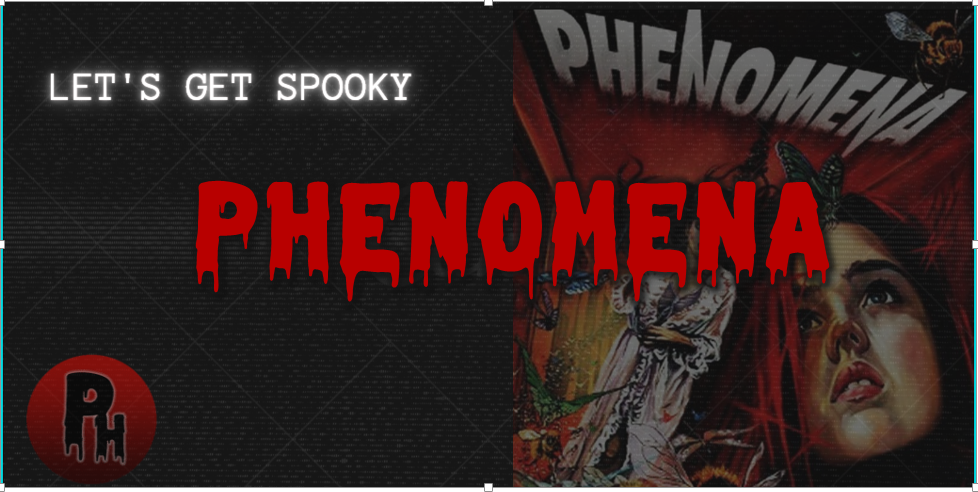
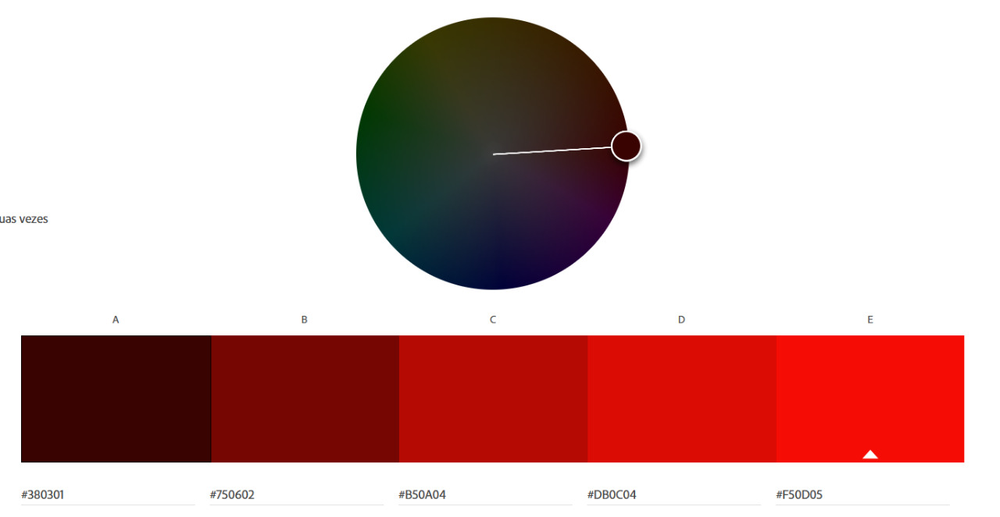
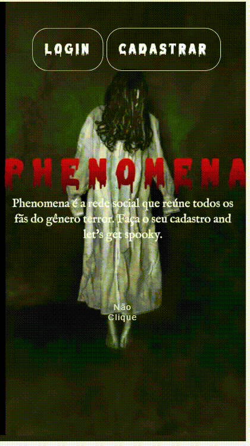
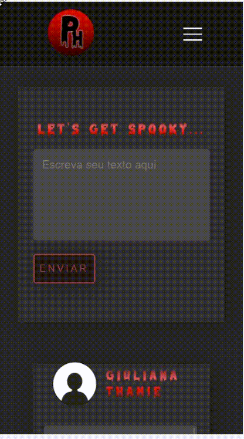

## :round_pushpin: Índice

* [1. Sobre o projeto](#1-sobre-o-projeto)
* [2. Histórias de usuários](#2-histórias-de-usuários)
* [3. Layout](#3-layout)
* [4. Experiência dos usuários](#4-experiência-dos-usuários)
* [5. Considerações Técnicas](#5-considerações-tecnicas)
* [6. Instalando e Executando](#6-instalando-e-executando)
* [7. Autoras](#7-autoras)

---

## 1. Sobre o projeto  :computer:

Phenomena é uma Rede Social que permite à qualquer usuário criar uma conta de acesso, logar-se com ela, criar, editar, deletar e dar likes em publicações.

 Esta rede social homenageia o filme de terror [PHENOMENA](https://www.imdb.com/title/tt0087909/), dirigido por Dario Argento. Criamos essa rede com intuito de unir a comunidade fã do genero terror, que há muito tempo não encontra um espaço para compartilhar sobre a temática. Se você se encaixa nesse perfil, está no lugar certo. 

O projeto foi realizado no  _bootcamp_ da [LABORATÓRIA](https://www.laboratoria.la/br).
Acesse aqui a [Phenomena](https://social-network-go-vegan.web.app) :computer_mouse:

## 2. Histórias de usuários :receipt:

Uma história do usuário é uma explicação informal e geral sobre um recurso de software escrita a partir da perspectiva do usuário final. Seu objetivo é articular como um recurso de software pode gerar valor para o cliente.

**Primeira História de Usuário**
>Eu como amante do genero terror e futuro usuário da rede social, gostaria de ter uma landing page diferenciada que remetesse a proposta da aplicaçao, onde pudesse escolher entre fazer cadastro e login. Gostaria que a pagina de cadastro possibilitasse cadastrar meu nome, email e senha de forma segura, com opção de cadastro com o Google. 

**Segunda História de Usuário**
> Desejo logar com email e senha, e também ter a opção de logar com a conta Google, e ter a possibilidade de resetar minha senha caso eu a esqueça.

**Terceira História de Usuário**
>Como usuário desejo acessar o feed, onde seja possivel escrever o meu proprio post, adiciona-lo ao feed e visualizar todos os outros posts que já estão publicados no feed também. 

**Quarta História de Usuário**
>Como usuário, na página de feed desejo poder curtir as postagens e também descurtir, alem de visualizar o numero de curtidas já efetuadas. Desejo conseguir editar e/ou excluir o meu proprio post.

## 3. Layout :art:

### Protótipo de baixa fidelidade :floppy_disk:
Um website nada mais é que um produto, dessa forma é muito importante o processo de construção do mesmo. 
Após as definições das necessidades dos usuários e pensando em sua experiencia com o produto, foram feitos os primeiros esboços dos esqueletos do site. Seguindo o requisito proposto pelo projeto, nosso Wireframe é considerado de Baixa Fidelidade, foi construido manualmente, com lápis e papel.
Os desenhos foram feitos já pensando na responsividade da tela, e projetados primeiramente para Mobile. 
Abaixo temos os desenhos das interfaces agrupadas por tamanho de tela: Desktop, Tablet e Mobile. 

**INSERIR PRINT DOS PROTÓTIPOS**

### Paleta de cores :red_circle: :black_circle:

 Para o layout, pensamos em uma paleta de cores que remete ao tema terror, com a preocupação de ser misturas equilibradas, o uso dos tons mais escuros, como as cores principais no feed permite explorar diferentes texturas e principalmente o balanço de luz e sombra. O tom vermelho facilita a identificação com o “perigo” e, consequentemente, com o terror. O vermelho, associado instintivamente com sangue, tem poder de chamar atenção do usuário.



### Demonstração da Aplicação :file_folder:

Por meio de gifs vamos demonstrar a usabilidade do nosso produto em formato Desktop, Tablet e Mobile:

**Demonstração pagina de cadastro, usuario logado e about Desktop**
<p align="center">   </p>


**Demonstração funcionalidades do feed Desktop**>
<p align="center">   </p>


**Demonstração pagina de login e about**
<p align="center">   </p>


**Demonstração funcionalidades do feed Mobile**

<p align="center">   </p>

## 4. Experiência dos usuários :right_anger_bubble:

#### Testes de usabilidade

A cada entrega de funcionalidade fizemos testes de usabilidade com alguns usuários. A partir desses testes verificamos a necessidade de fazer alterações na pagina de login e cadastro nos icones relativos ao google, anteriormente o icone fazia menção ao google plus, então iteramos conforme pedido do usuários. 
Melhoramos também o design da aplicação, padronizando as fontes e cores do feed, proporcionando assim uma experência visual mais agradável para os usuários.


## 5. Considerações Técnicas :trophy:

A estruturação do conteudo foi feita utilizando o _HTML_, como boa pratica fizemos o uso do HTML Semântico, pensando na acessibiliade do produto.

A estilização foi feita com o _CSS_, pudemos criar efeitos visuais, animações, pensando em como deixar o produto mais agradavel, dinamico e personalizado, tendo como foco o Mobile First. 

Para permitir o dinamismo e interatividade entre o usuário e o produto utilizamos o _JavaScript_, sendo a logica do projeto implementada inteiramente nessa linguagem. 

Verificamos a funcionalidade de nosso site atraves do _Jest_, framework de de testes em _JavaScript_, e o _ESlint_ aplicado para padronizar o código. 

Refatoramos nosso codigo e o organizamos em pastas, deixando assim a aplicação mais legivel e facilitando o entendimento do código. 

## 6. Instalando e Executando :desktop_computer:

**Dicas** :tada:

Para executar o projeto é preciso ter instalado no seu computador:
-Um editor de codigo, por exemplo o [VSCode](https://code.visualstudio.com/)
[Git](https://git-scm.com/downloads) [Node/NPM](https://nodejs.org/en/download/)

Agora faça uma instalação do Firebase na sua máquina - dessa maneira:

Esta etapa deve ser realizada por **TODAS integrantes**.

Este projeto está configurado para rodar por meio do servidor do Firebase. Para isso, será necessário possuir o [Firebase CLI](https://firebase.google.com/docs/cli#install_the_firebase_cli) instalado globalmente em sua máquina. Utilize o comando a seguir no seu terminal:

```bash
npm install -g firebase-tools
```

Verifique se foi instalado corretamente, realizando o [login](https://firebase.google.com/docs/cli#sign-in-test-cli):

```bash
firebase login
```

O login é feito por meio de uma conta Google, portanto, deve abrir uma janela em um navegador automaticamente para realizar o login. Se não abrir, pode clicar no link que vai aparecer no terminal.

Agora vamos instalar o projeto! 

-Para instalar esse projeto, basta clona-lo no seu terminal:
```sh
git clone https://github.com/tenorionique/SAP006-social-network.git
```

-Então instale as dependêcias do projeto dessa maneira:
```sh
npm install
```
-Executando o projeto no seu computador: 
```sh
npm start
```
-Para visualizar o projeto, basta copiar o link que vai aparecer e colar no seu navegador. 
```sh
http://localhost:5000
```
-Você pode executar os testes também:
```sh
npm test
```

## 7. Autoras :woman_technologist:
### Giuliana :woman_artist:
[@Giuthamie](https://github.com/Giuthamie)  [Linkedin](https://www.linkedin.com/in/giuliana-thami%C3%AA/)

### Mayara :woman_artist:
[@mayarabezerra](https://github.com/mayarabezerra)  [Linkedin](https://www.linkedin.com/in/maybezerra/)

### Monique :woman_artist:
[@tenorionique](https://github.com/tenorionique)  [Linkedin](https://www.linkedin.com/in/monique-doretto/)

---

Acesse aqui a [Phenomena](https://social-network-go-vegan.web.app) :computer_mouse:
